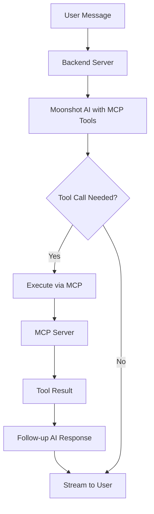

# MCP Integration Summary

This document summarizes the **Model Context Protocol (MCP) integration** implemented in Prism.

## ✅ What Was Implemented

### **1. MCP Client Manager (`server/mcpClient.js`)**
- **MCPManager class** to handle multiple MCP server connections
- **Tool discovery** and OpenAI function format conversion
- **Tool execution** with proper error handling
- **Connection management** with graceful shutdown

### **2. Backend Integration (`server/server.js`)**
- **OpenAI function calling** with MCP tools
- **Streaming support** with tool execution
- **Tool results** integrated into AI responses
- **MCP server auto-connection** on startup
- **API endpoints** for MCP status and management

### **3. Dummy MCP Server (`server/dummy-mcp-server.js`)**
For testing and demonstration:
- **calculator** - Basic math operations
- **get_time** - Current date/time with timezone support
- **generate_uuid** - UUID generation (v1/v4)
- **system_info** - System information

### **4. Frontend Components**
- **MCPStatusPanel** - Shows connected servers and available tools
- **Updated ChatPane** - MCP branding and tool-focused example prompts
- **Real-time tool execution** display in chat

## 🔄 How It Works



### **Flow Details:**
1. **Startup**: Backend connects to MCP servers and discovers tools
2. **Chat Request**: Frontend sends message to backend
3. **AI Processing**: Moonshot AI receives message + available MCP tools
4. **Tool Calling**: AI decides to use tools and sends function calls
5. **Tool Execution**: Backend executes tools via MCP and streams results
6. **Follow-up**: AI processes tool results and generates final response
7. **User Experience**: Real-time streaming of both tool execution and AI responses

## 🛠️ Key Features

### **Remote MCP Pattern**
- ✅ **OpenAI Function Calling** integration
- ✅ **MCP SDK** for server communication
- ✅ **Tool Discovery** and automatic registration
- ✅ **Streaming Tool Execution** with real-time feedback
- ✅ **Error Handling** for failed tool calls

### **Developer Experience**
- ✅ **Easy Server Addition** - Just add to config array
- ✅ **Status Monitoring** - Real-time MCP server status
- ✅ **API Endpoints** - Programmatic server management
- ✅ **Graceful Shutdown** - Proper connection cleanup

### **User Experience**
- ✅ **Tool Visibility** - See available tools in UI
- ✅ **Execution Feedback** - Watch tools being executed
- ✅ **Natural Language** - Just ask for calculations, time, etc.
- ✅ **Error Recovery** - Graceful handling of tool failures

## 📝 Example Usage

### **User Prompts:**
```
"Calculate 25 * 16 + 10"
"What time is it in Tokyo?"
"Generate a UUID for me"
"Show me system information"
```

### **AI Response Flow:**
```
User: "Calculate 25 * 16 + 10"
↓
AI: *calls calculator tool*
↓ 
🔧 Tool Executed: calculator
📝 Result: 25 multiply 16 = 400
↓
AI: "I'll help you with that calculation. 

🔧 **Tool Executed**: calculator
📝 **Result**: 25 multiply 16 = 400

So 25 × 16 + 10 = 400 + 10 = 410"
```

## 🔧 Technical Details

### **MCP Client Features:**
- **Stdio Transport** for local MCP servers
- **Multiple Server Support** with isolated tool namespaces
- **Tool Schema Conversion** to OpenAI function format
- **Connection Pooling** and lifecycle management

### **Integration Points:**
- **OpenAI Tools** parameter with MCP tool definitions
- **Streaming Parser** that handles both content and tool calls
- **Follow-up Completions** after tool execution
- **Error Boundary** handling for tool failures

### **Performance Optimizations:**
- **Connection Reuse** for MCP servers
- **Streaming Responses** for immediate user feedback
- **Tool Result Caching** within conversation context
- **Graceful Degradation** when tools fail

## 🚀 Extensibility

### **Adding New MCP Servers:**
```javascript
// In server/server.js
const mcpServers = [
  {
    id: 'filesystem',
    command: 'npx',
    args: ['-y', '@modelcontextprotocol/server-filesystem', '/path']
  },
  {
    id: 'database',
    command: 'python',
    args: ['database-mcp-server.py']
  }
];
```

### **Runtime Server Connection:**
```bash
curl -X POST http://localhost:3001/api/mcp/connect \
  -H "Content-Type: application/json" \
  -d '{"serverId": "weather", "command": "node", "args": ["weather-server.js"]}'
```

## 🎯 Benefits

### **For Developers:**
- **Standard Protocol** - Uses official MCP SDK
- **Tool Ecosystem** - Can connect to any MCP server
- **Type Safety** - Proper TypeScript interfaces
- **Debugging** - Comprehensive logging and status monitoring

### **For Users:**
- **Natural Interface** - Just chat normally
- **Tool Transparency** - See what tools are being used
- **Real-time Feedback** - Watch tool execution happen
- **Error Recovery** - Graceful handling of issues

### **For AI:**
- **Rich Capabilities** - Access to system tools and APIs
- **Context Preservation** - Tool results become part of conversation
- **Flexible Execution** - Can chain multiple tool calls
- **Error Handling** - Can retry or ask for clarification

## 📋 Next Steps

### **Potential Enhancements:**
- **More MCP Servers** - File system, database, web scraping
- **Tool Chaining** - Complex multi-step operations  
- **User Permissions** - Control which tools users can access
- **Tool History** - Log and analyze tool usage patterns
- **Custom Tools** - Easy framework for adding custom functionality

This implementation provides a **solid foundation** for MCP integration that can be extended with additional servers and capabilities as needed. 