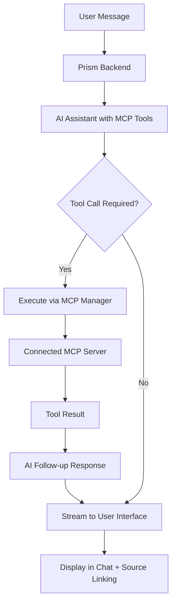

# MCP Integration in Prism

This document summarizes the **Model Context Protocol (MCP) integration** implemented in Prism, including support for Algolia MCP and other advanced tools.

## ✅ What Was Implemented

### **1. MCP Client Manager (`server/mcpClient.js`)**
- **MCPManager class** to handle multiple MCP server connections
- **Tool discovery** and OpenAI function format conversion
- **Tool execution** with proper error handling and streaming
- **Connection management** with graceful startup and shutdown
- **Multi-server support** for extensible tool ecosystems

### **2. Backend Integration (`server/server.js`)**
- **AI function calling** with MCP tools integration
- **Streaming support** with real-time tool execution
- **Tool results** seamlessly integrated into AI responses
- **Automatic MCP server connection** on startup
- **RESTful API endpoints** for MCP status and management
- **Error handling** with graceful degradation

### **3. Built-in MCP Tools (`server/dummy-mcp-server.js`)**
Demonstration server providing essential tools:
- **calculator** - Mathematical operations (add, subtract, multiply, divide)
- **get_time** - Current date/time with timezone support
- **generate_uuid** - UUID generation (v1/v4)
- **system_info** - System information and performance metrics

### **4. Frontend Components**
- **MCPStatusPanel** - Real-time display of connected servers and available tools
- **Enhanced ChatPane** - MCP-aware interface with tool execution visibility
- **Tool execution feedback** - Real-time display of tool calls and results
- **Context-aware responses** - AI responses that leverage MCP tool capabilities

## 🔄 How MCP Works in Prism



### **Detailed Flow:**
1. **Startup**: Backend discovers and connects to configured MCP servers
2. **Tool Discovery**: Available tools are registered and converted to AI function format
3. **Chat Request**: User message sent to backend with full context
4. **AI Processing**: AI assistant receives message + available MCP tools
5. **Smart Tool Selection**: AI decides which tools to use based on user intent
6. **Tool Execution**: Backend executes tools via MCP and streams results
7. **Contextual Response**: AI processes tool results and generates intelligent response
8. **User Experience**: Real-time streaming of both tool execution and AI reasoning

## 🛠️ Key Features

### **Advanced MCP Pattern**
- ✅ **Function Calling Integration** with modern AI models
- ✅ **MCP SDK** for robust server communication
- ✅ **Dynamic Tool Discovery** and automatic registration
- ✅ **Streaming Tool Execution** with real-time user feedback
- ✅ **Comprehensive Error Handling** for failed tool calls
- ✅ **Multi-server Architecture** for diverse tool ecosystems

### **Developer Experience**
- ✅ **Simple Server Addition** - Configuration-based setup
- ✅ **Real-time Monitoring** - Live MCP server status and health
- ✅ **API Management** - Programmatic server connection and control
- ✅ **Graceful Lifecycle** - Proper connection startup and cleanup
- ✅ **Extensible Architecture** - Easy integration of new MCP servers

### **User Experience**
- ✅ **Tool Transparency** - Clear visibility into available capabilities
- ✅ **Execution Feedback** - Watch tools being executed in real-time
- ✅ **Natural Interaction** - Just ask questions, tools are used automatically
- ✅ **Error Recovery** - Graceful handling of tool failures with alternatives
- ✅ **Context Preservation** - Tool results become part of conversation context

## 📝 Example Usage Patterns

### **Basic Tool Usage:**
```
User: "Calculate the compound interest on $5000 at 3.5% for 10 years"
↓
AI: *analyzes request and calls calculator tool*
↓ 
🔧 Tool Executed: calculator
📝 Input: 5000 * (1.035)^10
📊 Result: $7,058.48
↓
AI: "I'll calculate that compound interest for you.

🔧 **Tool Executed**: calculator  
📝 **Calculation**: $5,000 × (1.035)¹⁰ = $7,058.48

Your $5,000 investment at 3.5% annual compound interest over 10 years would grow to $7,058.48, representing a total gain of $2,058.48."
```

### **Data Analysis Integration:**
```
User: "What time was this sales report generated?" (referring to uploaded file)
↓
AI: *calls get_time tool for current reference and analyzes file metadata*
↓
🔧 Tool Executed: get_time
📝 Result: Current time is 2024-01-15 14:30:00 PST
↓
AI: "Based on your uploaded sales report metadata and current time reference:

🔧 **Tool Executed**: get_time
📝 **Current Time**: January 15, 2024 at 2:30 PM PST

The sales report 'Q4_2023_Results.xlsx' was generated on December 31, 2023 at 11:45 PM EST, which was about 2 weeks ago. This timing aligns with typical end-of-quarter reporting cycles."
```

## 🔧 Technical Implementation

### **MCP Client Architecture:**
- **Stdio Transport** for local MCP server communication
- **Process Management** with proper lifecycle handling
- **Tool Schema Conversion** to OpenAI function calling format
- **Connection Pooling** for efficient resource utilization
- **Error Boundaries** with fallback mechanisms

### **Integration Points:**
- **Function Definitions** passed to AI models as available tools
- **Streaming Parser** that handles both content and tool calls
- **Follow-up Completions** after tool execution for context integration
- **Result Formatting** for user-friendly tool output display

### **Performance Optimizations:**
- **Connection Reuse** for MCP servers across requests
- **Streaming Responses** for immediate user feedback
- **Tool Result Caching** within conversation sessions
- **Graceful Degradation** when tools are unavailable

## 🚀 Algolia MCP Integration

Prism is designed to seamlessly integrate with Algolia MCP servers for advanced search capabilities:

### **Algolia Search Integration Example:**
```javascript
// In server/server.js - Add Algolia MCP server
const mcpServers = [
  {
    id: 'demo-tools',
    command: 'node',
    args: [path.join(__dirname, 'dummy-mcp-server.js')]
  },
  {
    id: 'algolia-search',
    command: 'npx',
    args: ['-y', '@modelcontextprotocol/server-search', 
           '--algolia-app-id', process.env.ALGOLIA_APP_ID,
           '--algolia-api-key', process.env.ALGOLIA_API_KEY]
  }
];
```

### **Algolia-Enhanced Workflows:**
- **Intelligent Search**: "Search for products similar to the ones in my uploaded catalog"
- **Data Discovery**: "Find relevant documentation about this API endpoint"
- **Content Analysis**: "Search for similar content patterns in our knowledge base"
- **Cross-Reference**: "Find related data points across multiple indexes"

## 🌟 Advanced Use Cases

### **Multi-Tool Workflows:**
```
User: "Analyze my sales data and search for industry benchmarks"
↓
AI: *Uses calculator for data analysis + Algolia search for benchmarks*
↓
🔧 Tools Executed: calculator, algolia_search
📊 Analysis: Revenue trends + Industry comparisons
↓
AI: "I've analyzed your sales data and found relevant industry benchmarks..."
```

### **Time-Sensitive Analysis:**
```
User: "When should I schedule the next product launch based on current market data?"
↓  
AI: *Uses get_time + data analysis + search for market insights*
↓
🔧 Tools Executed: get_time, calculator, algolia_search
📅 Recommendation: Optimal timing based on multiple factors
```

## 📋 Extensibility Framework

### **Adding New MCP Servers:**
```javascript
// Configuration-based addition
const mcpServers = [
  {
    id: 'filesystem',
    command: 'npx',
    args: ['-y', '@modelcontextprotocol/server-filesystem', '/data']
  },
  {
    id: 'database',
    command: 'python',
    args: ['database-mcp-server.py', '--connection-string', process.env.DB_URL]
  },
  {
    id: 'custom-analytics',
    command: 'node',
    args: ['custom-analytics-server.js']
  }
];
```

### **Runtime Server Management:**
```bash
# Add servers dynamically via API
curl -X POST http://localhost:3001/api/mcp/connect \
  -H "Content-Type: application/json" \
  -d '{
    "serverId": "weather-service", 
    "command": "node", 
    "args": ["weather-mcp-server.js", "--api-key", "your-key"]
  }'
```

## 🎯 Benefits & Impact

### **For Data Analysts:**
- **Enhanced Capabilities** - Access to search, calculation, and system tools
- **Contextual Intelligence** - Tools work together with uploaded data
- **Workflow Acceleration** - Complex analyses simplified through natural language
- **Real-time Feedback** - See calculations and searches happen instantly

### **For Developers:**
- **Extensible Platform** - Easy integration of new capabilities
- **Standard Protocol** - Uses official MCP specifications
- **Type Safety** - Full TypeScript support with proper interfaces
- **Monitoring Tools** - Comprehensive logging and status tracking

### **For Organizations:**
- **Unified Interface** - Single platform for data analysis and search
- **Custom Integration** - Connect internal tools and databases
- **Scalable Architecture** - Add capabilities without rebuilding
- **Knowledge Management** - Combine file analysis with organizational search

## 📈 Future Enhancements

### **Planned Integrations:**
- **Advanced Algolia Features** - Faceted search, analytics, personalization
- **Database Connectors** - Direct integration with SQL/NoSQL databases
- **File System Tools** - Advanced file operations and management
- **API Integrations** - Connect to external services and APIs
- **Custom Analytics** - Domain-specific analysis tools

### **Enhanced Capabilities:**
- **Multi-step Workflows** - Complex orchestration of multiple tools
- **User Permissions** - Fine-grained access control for tools
- **Tool Composition** - Combine simple tools into powerful workflows
- **Performance Analytics** - Detailed metrics on tool usage and performance

## 🔍 Monitoring & Debugging

### **MCP Status Dashboard:**
- Real-time server connection status
- Available tools and their descriptions  
- Tool execution history and performance
- Error logs and troubleshooting information

### **Debug Information:**
```javascript
// Check MCP status programmatically
fetch('/api/mcp/info')
  .then(res => res.json())
  .then(data => {
    console.log('Connected servers:', data.servers.length);
    console.log('Available tools:', data.tools.length);
    console.log('Server status:', data.servers.map(s => s.status));
  });
```

---

This MCP integration provides **Prism** with a powerful, extensible foundation for AI-powered data analysis. The architecture supports everything from basic calculations to advanced search and analysis workflows, with seamless integration of Algolia MCP and other specialized tools.