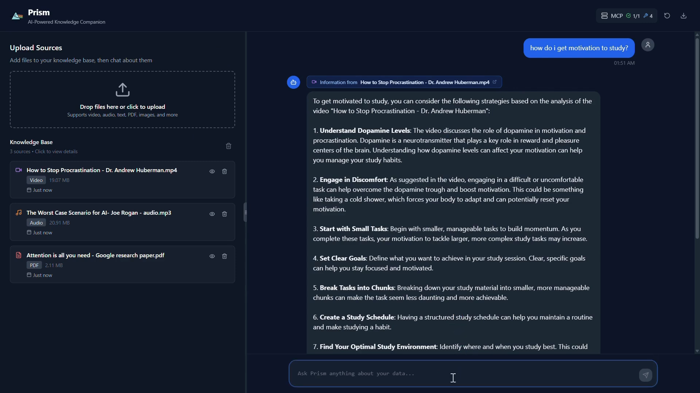

# Prism

**AI-Powered Personal Knowledge Companion**

Prism is an intelligent personal knowledge platform that revolutionizes how you organize, search, and interact with your content. Upload any type of file (documents, images, videos, audio) and chat with your data using AI. Our system analyzes your files with Google's Gemini 2.5 Pro and automatically creates a searchable personal knowledge base using **Algolia MCP (Model Context Protocol)** integration, enabling natural language conversations about your content.



## 🌟 Key Features

### 📄 Universal Personal File Analysis
- **Multi-format Support**: Analyze your text files, PDFs, images, videos, audio, and more
- **AI-Powered Insights**: Comprehensive analysis of your content using Google Gemini 2.5 Pro
- **Instant Processing**: Drag-and-drop your files for immediate AI analysis

### 🔍 Personal Knowledge Base with Algolia Search
- **Automatic Indexing**: All your file analyses are saved to your personal Algolia index
- **Contextual Search**: Ask questions and AI automatically searches your knowledge base
- **Smart Retrieval**: Your relevant content is retrieved and used to enhance AI responses

### 💬 Intelligent Chat Interface
- **Moonshot v1 AI**: Advanced conversational AI that understands your content
- **Streaming Responses**: Real-time responses as you chat with your data
- **Source Linking**: AI responses automatically reference your uploaded files

### 🔧 MCP Tool Integration
- **Algolia MCP Server**: Primary integration for search and data storage
- **Tool Transparency**: See which tools are being used and their results
- **Extensible Architecture**: Connect to multiple MCP servers for additional capabilities

### 🎨 Modern Personal Interface
- **Dual-Panel Design**: Manage your files and chat with your content side-by-side
- **Customizable Layout**: Resize panels to match your personal workflow
- **Modern Dark Theme**: Comfortable interface for extended use
- **Real-time Updates**: Live streaming of AI responses as you explore your content

## 🏗️ Architecture


```
┌─────────────────┐     ┌──────────────────┐    ┌─────────────────┐
│   React Frontend │────│  Express Backend │────│  Moonshot v1 AI │
│   (File Upload)  │    │   (API Server)   │    │ (Chat & Tools)  │
└─────────────────┘     └──────────────────┘    └─────────────────┘
                                │
                                ▼
                       ┌──────────────────┐
                       │   Algolia MCP    │
                       └──────────────────┘
                                │
                                ▼
                       ┌──────────────────┐
                       │ Algolia Search   │
                       │ (Knowledge Base) │
                       └──────────────────┘
```

### How It Works

1. **Upload Your Files**: Drag-and-drop your personal files into the interface
2. **AI Analysis**: Google Gemini 2.5 Pro analyzes your file content
3. **Personal Knowledge Base**: Analysis results are automatically saved to your Algolia index using MCP
4. **Ask Questions**: When you ask questions about your content, the system:
   - Extracts key terms from your query
   - Uses Algolia MCP's `searchSingleIndex` tool to find relevant content from your files
   - Provides context to Moonshot AI for personalized responses
5. **Contextual Answers**: AI generates responses based on your specific content and query

## 🚀 Quick Start

### Prerequisites

- Node.js 18+ and npm
- Google Gemini API key
- Moonshot API key
- Algolia Application ID and Index Name
- Algolia MCP Server setup

### Installation

1. **Clone and Install**
   ```bash
   git clone <repository-url>
   cd prism-algolia
   npm install
   ```

2. **Environment Configuration**
   
   **Frontend**:
   ```bash
   cp env.example .env
   ```

   **Backend**:
   ```bash
   cd server
   cp .env.example .env
   ```
   
   Edit `server/.env`:
   ```env
   # AI Configuration
   MOONSHOT_API_KEY=your_moonshot_api_key_here
   MOONSHOT_BASE_URL=https://api.moonshot.cn/v1
   MOONSHOT_MODEL=moonshot-v1-8k
   
   # Algolia Configuration (Required for MCP)
   ALGOLIA_APPLICATION_ID=your_algolia_app_id
   ALGOLIA_INDEX_NAME=prism-data
   
   # Server Configuration
   PORT=3001
   FRONTEND_URL=http://localhost:5173
   NODE_ENV=development
   
   # MCP Server Configuration
   MCP_NODE_PATH=/path/to/node
   MCP_SERVER_PATH=/path/to/algolia-mcp-server
   ```

3. **Start the Application**
   ```bash
   npm run dev:full
   ```
   
   This starts both:
   - Backend server on `http://localhost:3001`
   - Frontend on `http://localhost:5173`
   - Algolia MCP server automatically connected

### Algolia MCP Server Setup

Prism requires the Algolia MCP server to be running. Configure the path in your `server/.env`:

```env
   MCP_NODE_PATH=/path/to/node
   MCP_SERVER_PATH=/path/to/algolia-mcp-server
```

## 🔧 Core Components

### Frontend Architecture

**Main Components**:
- `App.tsx` - Main application layout with resizable panels
- `FileAnalysisPane.tsx` - File upload and knowledge base display
- `ChatPane.tsx` - AI chat interface with MCP status
- `MCPStatusPanel.tsx` - Real-time MCP server and tool status

**Services**:
- `fileAnalyzer.ts` - Google Gemini integration for file analysis
- `moonshot.ts` - Moonshot AI API integration with streaming
- `localStorage.ts` - Local storage management for file analyses

### Backend Architecture

**Key Files**:
- `server.js` - Main Express server with Algolia MCP integration
- `mcpClient.js` - MCP connection manager supporting HTTP and STDIO

**API Endpoints**:
- `POST /api/chat` - Chat completion with MCP tool integration
- `POST /api/save-analysis` - Save file analysis to Algolia
- `GET /api/mcp/info` - MCP server and tool status
- `GET /health` - Health check with MCP status

### MCP Integration

**Algolia MCP Tools**:
- `searchSingleIndex`: Search Algolia index for relevant data
- `saveObject`: Save analysis results to Algolia index

**Tool Flow**:
1. File analysis results automatically saved using `saveObject`
2. User queries trigger `searchSingleIndex` to find relevant context
3. Retrieved data enhances AI responses with specific file information

## 📝 Usage Guide

### File Analysis Workflow

1. **Upload Files**: Drag files to the left panel or click to browse
2. **AI Processing**: Gemini analyzes content and structure
3. **Auto-Save**: Results automatically saved to Algolia
4. **Knowledge Base**: View all uploaded files in the left panel

### Chat Interaction

1. **Ask Questions**: Type queries about your uploaded data
2. **Contextual Search**: AI automatically searches your knowledge base
3. **Enhanced Responses**: Get answers based on your specific files
4. **Source Linking**: Responses reference relevant uploaded files

### Example Queries

**Personal File Questions**:
```
"What are the key points in my presentation?"
"Summarize the data trends in my personal spreadsheet"
"What did I write about project goals in my notes?"
"Find the main themes in my uploaded research papers"
```

**Cross-Content Analysis**:
```
"Compare the ideas across all my uploaded documents"
"Find mentions of 'productivity' in any of my files"
"What insights can you draw from all my personal content?"
"How do my meeting notes relate to my project files?"
```

## 🔍 Algolia MCP Integration Details

### Why Algolia MCP Powers Your Personal Knowledge

Prism is built around Algolia's powerful search capabilities for your personal content:

1. **Personal Knowledge Storage**: All your file analyses are stored in your own structured Algolia index
2. **Instant Search**: Sub-second search across all your personal content
3. **Contextual Retrieval**: AI queries automatically find relevant information from your files
4. **Grows With You**: Handle thousands of personal files with consistent performance

### Data Structure

Files are stored in Algolia with this structure:
```json
{
  "resource_details": "AI analysis of file content",
  "resource_type": "document|image|video|audio|text",
  "fileName": "original-filename.ext",
  "fileSize": "formatted size",
  "uploadDate": "ISO timestamp"
}
```

### Personal Search Integration

The system automatically:
1. Extracts search terms from your questions
2. Searches your personal knowledge base using `searchSingleIndex`
3. Provides your most relevant content as context to the AI
4. Generates responses that reference your specific files

## 🔧 Development

### Project Structure

```
prism-algolia/
├── src/                     # React frontend
│   ├── components/          # UI components
│   │   ├── ChatPane.tsx     # Main chat interface
│   │   ├── FileAnalysisPane.tsx # File upload/management
│   │   ├── MCPStatusPanel.tsx   # MCP server status
│   │   └── ...
│   ├── services/            # Core services
│   │   ├── fileAnalyzer.ts  # Gemini integration
│   │   ├── moonshot.ts      # AI chat service
│   │   └── localStorage.ts  # Data persistence
│   └── types/               # TypeScript definitions
├── server/                  # Express backend
│   ├── server.js           # Main server with MCP
│   ├── mcpClient.js        # MCP connection manager
│   └── package.json        # Server dependencies
└── package.json            # Frontend dependencies
```

### Key Technologies

**Frontend**:
- React 18 with TypeScript
- Tailwind CSS for styling
- Lucide React for icons
- Vite for build tooling

**Backend**:
- Express.js server
- Model Context Protocol (MCP) SDK
- OpenAI SDK for Moonshot integration
- CORS and environment configuration

**AI & Search**:
- Google Gemini 2.5 Pro (file analysis)
- Moonshot v1 (conversational AI)
- Algolia (search and storage via MCP)

### Environment Variables

**Server Configuration** (`server/.env`):
```env
# Required
MOONSHOT_API_KEY=your_moonshot_key
ALGOLIA_APPLICATION_ID=your_algolia_app_id
ALGOLIA_INDEX_NAME=your_index_name

# Optional
MOONSHOT_BASE_URL=https://api.moonshot.cn/v1
MOONSHOT_MODEL=moonshot-v1-8k
PORT=3001
FRONTEND_URL=http://localhost:5173
NODE_ENV=development

# MCP Server Paths
MCP_NODE_PATH=/path/to/node
MCP_SERVER_PATH=/path/to/algolia-mcp-server
```

### Build and Deployment

**Development**:
```bash
npm run dev:full          # Start both frontend and backend
npm run dev               # Frontend only
npm run server:dev        # Backend only
```

**Production**:
```bash
npm run build             # Build frontend
cd server && npm start    # Start production server
```

## 🔍 MCP Status and Monitoring

### Real-Time MCP Status

The application includes a comprehensive MCP status panel:

- **Server Status**: Connection status of all MCP servers
- **Tool Availability**: List of available tools with descriptions
- **Real-Time Updates**: Refresh capability for live status
- **Tool Execution Logs**: See tool calls and results in chat

### Troubleshooting MCP Connections

1. **Check MCP Status Panel**: Click the MCP button in the top-right
2. **Verify Paths**: Ensure `MCP_NODE_PATH` and `MCP_SERVER_PATH` are correct
3. **Check Logs**: Monitor server console for MCP connection messages
4. **Test Tools**: Use the health endpoint `/api/mcp/info`

## 🚀 Advanced Features

### Custom File Analysis

The file analyzer supports multiple formats:
- **Text Files**: Content analysis, themes, structure
- **Images**: Visual description, text extraction, scene analysis
- **Videos**: Content summary, scene detection, duration analysis
- **Audio**: Content type detection, speech recognition
- **PDFs**: Document structure, content extraction
- **Generic Files**: Type-based analysis and metadata

### Streaming Chat Interface

- **Real-Time Responses**: See AI responses as they're generated
- **Tool Execution Visibility**: Watch MCP tools being called
- **Source References**: Automatic linking to relevant uploaded files
- **Export Conversations**: Save chat history and analysis results

### Resizable Interface

- **Adaptive Layout**: Drag the divider to resize panels
- **Workflow Optimization**: Adjust for file-heavy or chat-heavy tasks
- **State Persistence**: Layout preferences maintained across sessions

## 🤝 Contributing

1. Fork the repository
2. Create a feature branch
3. Make your changes
4. Test with Algolia MCP integration
5. Submit a pull request

### Development Guidelines

- Follow TypeScript best practices
- Maintain Algolia MCP integration
- Test file upload and analysis workflows
- Ensure MCP server compatibility
- Update documentation for new features

## 📄 License

MIT License - see LICENSE file for details

---